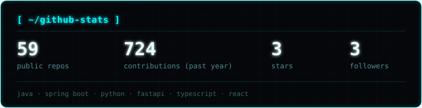
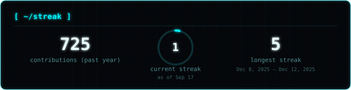

<div align="center">


<br/>


</div>

<br/>

## `[ ~/whoami ]`

```
> Full-time backend developer, building scalable AI applications and
  management platforms with Java, Spring Boot, and React.

> Currently interning at Fracktal Works — backend + AI integration.
```

<br/>

## `[ ~/stack ]`

<div align="center">


</div>

<br/>

## `[ ~/stats ]`

<div align="center">




</div>

<br/>

## `[ ~/featured ]`

<table>
<tr>
<td width="50%" valign="top">

### `◆` [Tipper-Hotel](https://github.com/ReebanAustrive/Tipper-Hotel)
`JAVA`
Hotel management platform — backend-driven booking and operations handling built in Java.

</td>
<td width="50%" valign="top">

### `◆` [TaskAPI](https://github.com/ReebanAustrive/TaskAPI)
`JAVA`
Backend + AI sprint project — task management API, first milestone of a broader backend/AI roadmap.

</td>
</tr>
<tr>
<td width="50%" valign="top">

### `◆` [QRCode-API](https://github.com/ReebanAustrive/QRCode-API)
`C#`
Lightweight API for generating and serving QR codes on demand.

</td>
<td width="50%" valign="top">

</td>
</tr>
</table>

<br/>

## `[ ~/notes ]`

```
> off the clock: chess, MotoGP, and a bit of stoicism —
  turns out calm decision-making under pressure works
  the same whether it's a race, a board, or a bug.
```

<br/>

## `[ ~/connect ]`

<div align="center">

[](https://reebanportfolio.vercel.app/)
[](https://linkedin.com/in/reeban-austrive-11019a254)
[](mailto:reeban.austrive.s76@kalvium.community)

</div>

<div align="center">
<sub>05070a / 00F5FF / e8feff — signal locked.</sub>
</div>